# ICON structured grid benchmark

<!-- _paginate: skip  -->
<!-- _class: titlecover -->
<!-- _footer: "" -->

### CSCS

---

# Introduction

## Motivation

- ICON grid is partly structured
- Investigate how expensive are indirect neighbor accesses compared to strided indexes of neighbors
- Investigate optimizations based on strided indexes
- Apply optimizations to current and future `GT4Py` development

---

# ICON grid handling

## ICON grid input

- `netcdf` file with neighbor lists
- Use of structured torus grid
  - Generated using [grid-generator](https://gitlab.dkrz.de/mpim-sw/grid-generator) from `DKRZ` by **David Strassman**
  - Read using [icon4py GridManager](https://github.com/C2SM/icon4py/blob/main/model/common/src/icon4py/model/common/grid/grid_manager.py)

---

## Manipulation of ICON grid

### Torus grid characteristics

- Torus grid has periodic boundaries
  - Adds complexity to compute strided indexes
  - Not applicable in production scenario of CH

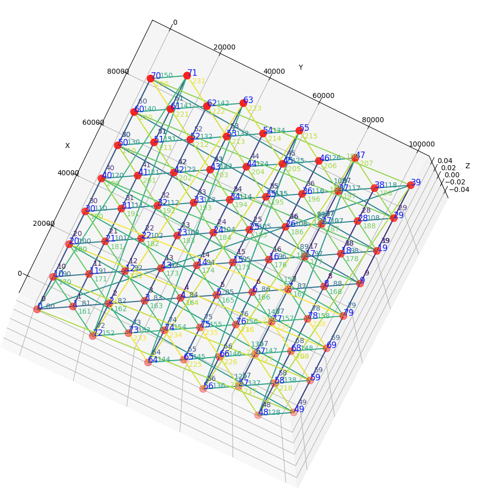

---

## Manipulation of ICON grid

### Selection of computation domain

- Filter torus grid to end up with a cartesian grid with 2 level halo
  - 1 would also be sufficient
  - Discard periodic edges
- Calculate `X` and `Y` dimensions based on the distribution of vertices in space
  - `x_dim` equals the number of vertices with `y == 0`

### Computation domain in red

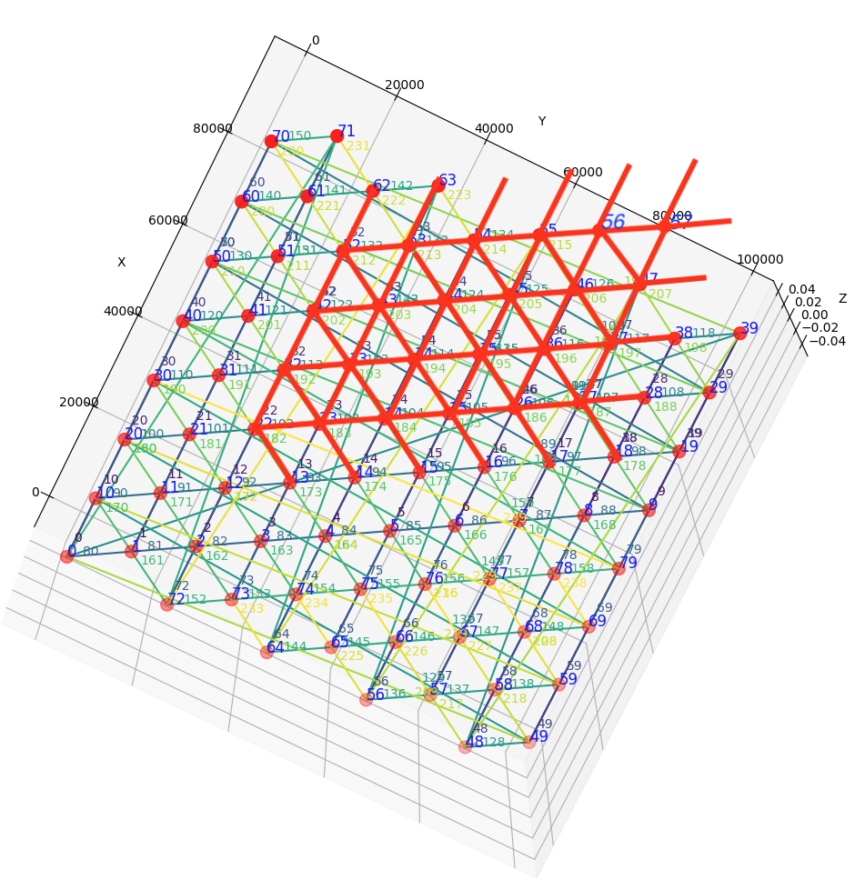

---

## Manipulation of ICON grid

### Organization of edges in memory

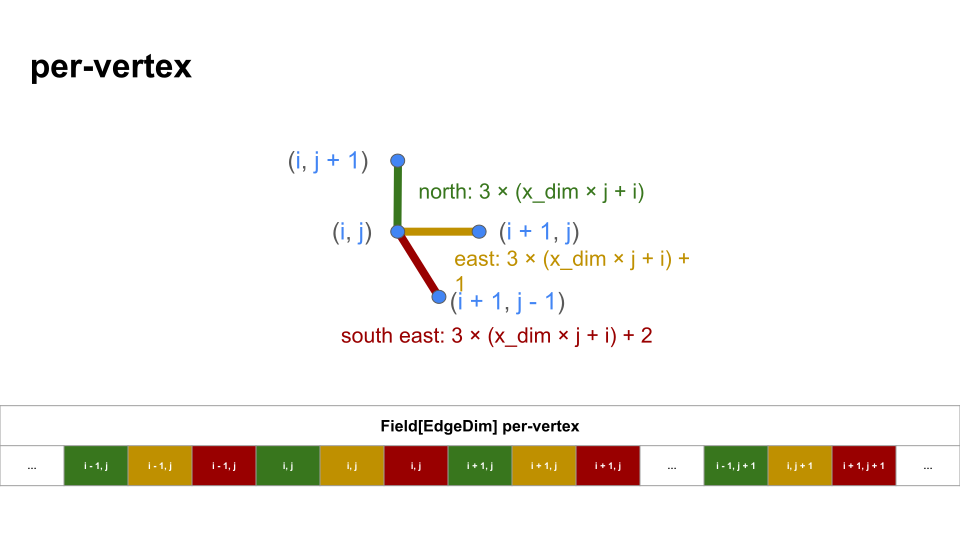

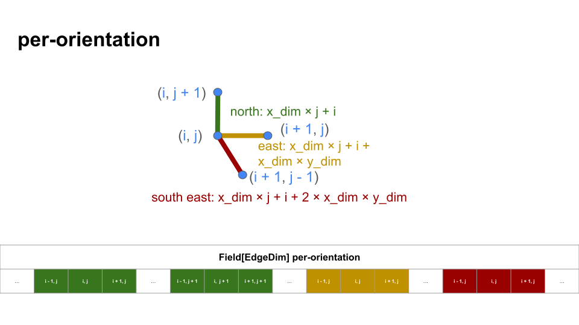

---

## Manipulation of ICON grid

### Organization of cells in memory

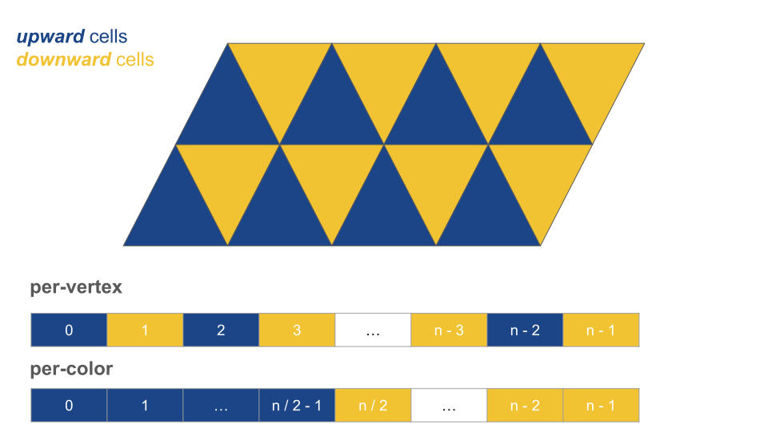

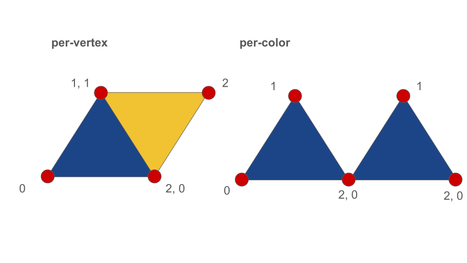

---

## Manipulation of ICON grid

### Selection of computation domain

- Fix `e2v` ordering of edges read by torus grid file to be by default `per-vertex` in [GridManager](https://github.com/iomaganaris/icon4py/blob/0f861306c65e135345aac534a5e0283de6e8554e/model/common/src/icon4py/model/common/grid/grid_manager.py#L499)
  - Some elements in `e2v` didn't follow this ordering by default
- Select between `per-vertex` and `per-orientation` ordering in [GridManager](https://github.com/iomaganaris/icon4py/blob/0f861306c65e135345aac534a5e0283de6e8554e/model/common/src/icon4py/model/common/grid/grid_manager.py#L500)
- Filter halo vertices and edges in [benchmark python script](https://github.com/GridTools/icon_structured_benchmark/blob/main/run_filtered_torus_grid_int_nabla4_interpolate.py#L74)

### Computation domain in red

---

## Selected kernels for exploration

- [Nabla4](https://github.com/C2SM/icon4py/blob/a32640c8bacc65bbafe41ec9a68b772c7a3c1853/model/atmosphere/diffusion/src/icon4py/model/atmosphere/diffusion/stencils/calculate_nabla4.py#L23)
  - Neighbor tables
    - **e2c2v[4]**
    - **e2ecv[4]**
  - Input fields
    - **u_vert[VertexDim, KDim]**
    - **v_vert[VertexDim, KDim]**
    - **primal_normal_vert_v1[EdgeDim * ECVDim]**
    - **primal_normal_vert_v2[EdgeDim * ECVDim]**
    - **z_nabla2_e[OutputEdgeDim, KDim]**
    - **inv_vert_vert_length[OutputEdgeDim]**
    - **inv_primal_edge_length[OutputEdgeDim]**
  - Output field
    - **z_nabla4_e2[OutputEdgeDim, KDim]**

---

## Selected kernels for exploration

- [Interpolate](https://github.com/C2SM/icon4py/blob/main/model/common/src/icon4py/model/common/interpolation/stencils/mo_intp_rbf_rbf_vec_interpol_vertex.py#L19)
  - - Neighbor tables
    - **v2e[6]**
  - Input fields
    - **p_e_in[EdgeDim, KDim]**
    - **ptr_coeff_1[OutputVertexDim, 6]**
    - **ptr_coeff_2[OutputVertexDim, 6]**
  - Output fields
    - **p_u_out[OutputVertexDim, KDim]**
    - **p_v_out[OutputVertexDim, KDim]**

---

## Selected kernels for exploration

- [verts2cells](https://github.com/GridTools/icon_structured_benchmark/blob/main/tests/test_verts2cells.py#L36)
  - Artifical kernel
    - Interpolates `p_u_out` and `p_v_out` of vertices to cell
  - Neighbor tables
    - **c2v[3]**
  - Input fields
    - **p_u_in[VertexDim, KDim]**
    - **p_v_in[VertexDim, KDim]**
    - **ptr_c_coeff_1[OutputCellDim, 6]**
    - **ptr_c_coeff_2[OutputCellDim, 6]**
  - Output fields
    - **p_cell_out[OutputCellDim, KDim]**

---

## Nabla4 execution

  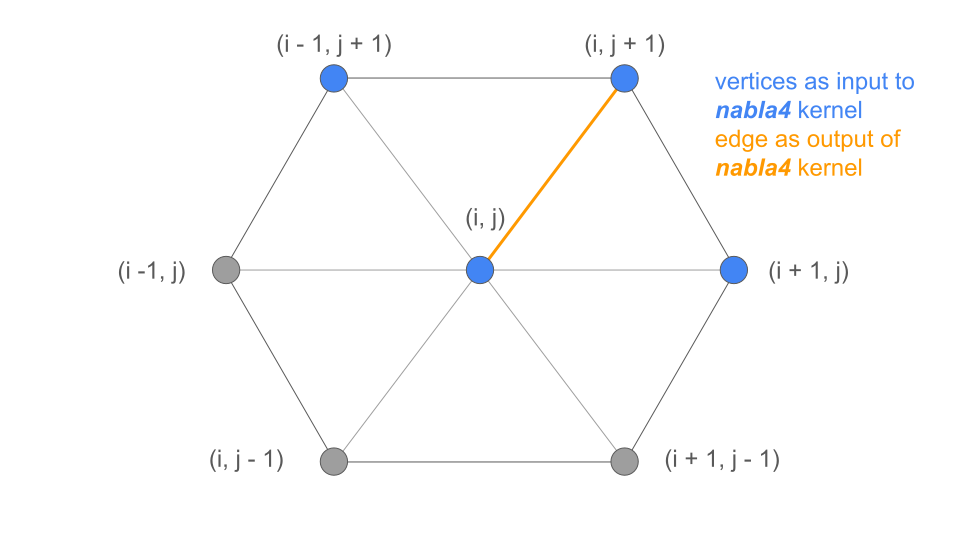

---

## Nabla4 execution

  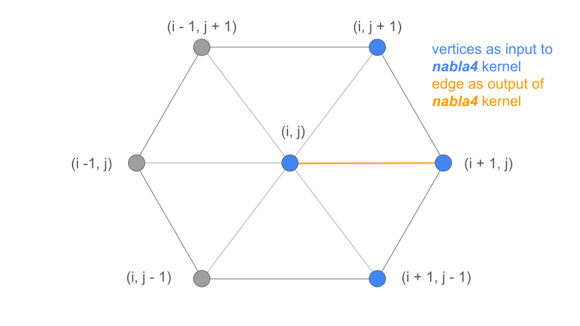

---

## Interpolate execution

  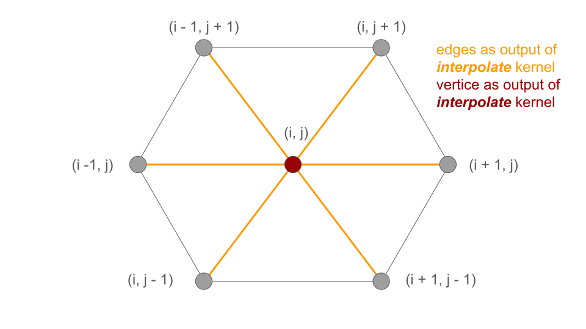

---

## Nabla4 & Interpolate inlined v2e[e2c2v] execution

  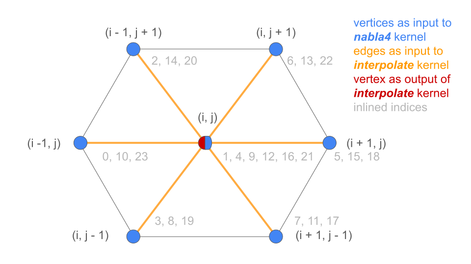

---

## Nabla4 & Interpolate inlined v2e2c2v execution

  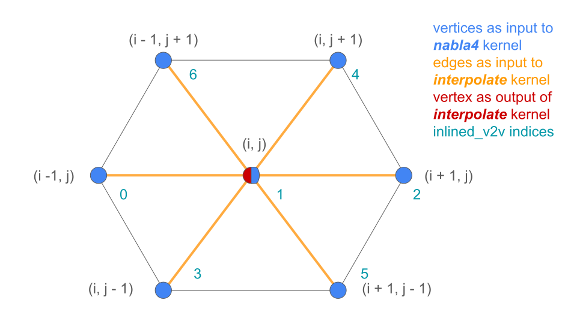

---

## Nabla4, Interpolate & verts2cells execution

  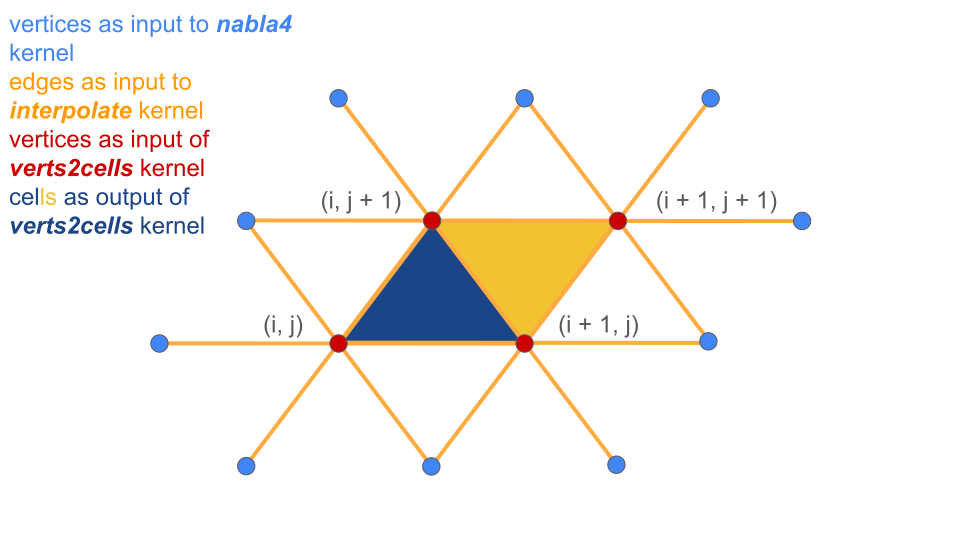

---

## Kernel implementations

- Neighbor accesses
  - Indirect
    - Indirect accesses via neighbor tables
  - Strided
    - Neighbor accesses via strides
- Iteration strategies
  - `gpu_naive`
    - Default iteration strategy in `GridTools C++`
    - One GPU thread calculates 1 element in horizontal and vertical axis
  - `gpu_kloop`
    - Optional iteration strategy in `GridTools C++`
    - One GPU thread calculates 1 element in horizontal axis but multiple vertical levels
    - Save neighbors and vertically independent fields in registers and iterate over multiple vertical fields

---

## Kernel implementations

- Separate
  - Execute `nabla4` kernel, then `interpolate` and then `verts2cells`
- Inlined
  - Compute `nabla4` and `interpolate` outputs for every input of `verts2cells` kernel
  - More computations
  - Less writes to device memory
- Inlined c2v (`indirect` only)
  - Compress `c2v[v2e[e2c2v]]` neighbor accesses to `c2v2e2c2v`
    - Read fields for 12 vertices instead of (6\*4\*3=) 72 vertices
  - Assumes certain order of cells in `c2v`, vertices in `e2c2v` and edges in `v2e`

  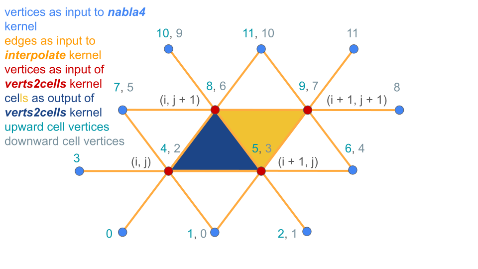

---

## Kernel implementations

- Inlined strided
  - Computation of upward and downward cell corresponding to vertex `(i, j)` is done by the same thread at the same time to save memory loads
- Inlined_v2v_separate (`indirect` only)
  - Execute the `inlined_v2v` implementation for `nabla4` and `interpolate` kernels and then execute separately the `verts2cells` kernel
    - Improves register pressure
- Inlined cached
  - Save to shared memory the intermediate output of `nabla4` and `interpolate` kernels only for the necessary fields to calculate the output cells of each threadblock
    - Reduces overcomputations as much as possible

  

---

## Kernel implementations

- `gtfn`
  - Only `indirect`
  - Based on `GridTools C++`
  - Improved `GridTools C++`
    - Memory loads via `__ldg`
    - `gpu_kloop` option
    - `const` neighbor tables and input fields
    - Kudos to **Felix Thaler**
- `CUDA`
  - Plain cuda kernels
  - Launched by python script
  - Random input in benchmarks
  - Validated kernels with serialized data from `GT4Py`

---

## General kernel optimizations

- Occupancy
  - All kernels have been optimized for best occupancy
- `__launch_bounds__` and `__maxnreg__`
  - Launch bounds are applied to all kernels except some that were performing better with register limitation to a certain number of registers
- Thread Block size
  - Specifically for `gpu_naive` implementations, increasing the vertical axis thread block size (`ThreadBlockDim.y/z`) was beneficial since there are more chances to find neighbor tables and vertically independent fields in cache
  - 4-8-9 most used number with 80 vertical levels in total. For some kernels 12 or 16
- `gpu_kloop`
  - For this implementation vertical `GridDim` is set to 1. Iteration number is controlled by `ThreadBlockDim.y/z` and `KDim`. Exceptions are the `inline_cached` versions where the shared memory size is limiting the number of iterations possible
  - Optimized number of iterations per kernel. 5-40 iterations. 8-20 usually have the best performance

---

## Notes for specific kernels

- `strided_gpu_{naive,kloop}_inlined_cached`: Tried 2 different implementations, number of threads same as input but then deactivate for the output some of them and number of threads same as output where each thread caclulates multiple elements. Former is better
- `strided_*_inlined`: calculate only necessary indexes, similar to `c2v2e2c2v`
- `indirect_*_inlined_c2v`: pass `c2v2e2c2v` as input
- `indirect`: `nabla4` iterates on edges (`per-orientation` - 1 edge per thread)
- `strided`: `nabla4` iterates on vertices (`per-vertex` - 3 edges per vertex/thread)
- `strided`: `verts2cells` calculates both upward and downward cells together
- Both `strided` and `indirect` versions operate on data with same ordering in memory
  - No SFC. Vertices and cells are ordered per `i` and `j` coordinates and `edges` per `orientation/vertices`
- `strided`: `e2ecv` is also computed

---

## Notes for specific kernels

- Smaller grids benefit by more threads and less `k level` iterations
- Loop in `k` is done with stride `blockDim.y/z * gridDim.y/z`
  - It would be more beneficial for kernels that read data from adjacent `k` levels to do the looping with stride `1` in each thread
    - Current implementation in `gtfn`, not on the `CUDA` kernels since we don't evaluate such case

---

## Results

- `GH200` GPU
- Median runtime presented
  - 10 dry runs (not taken into account)
  - 101 runs to select median
- 229758 edges
  - Close to the amount of edges that fit in a single GPU for ICON runs
- 915948 edges
  - For exploration
- Commit [5272141](https://github.com/GridTools/icon_structured_benchmark/commit/5272141d9f812adeec2c6dfd94aa729901a8e1dd)

---

## gtfn improvements

  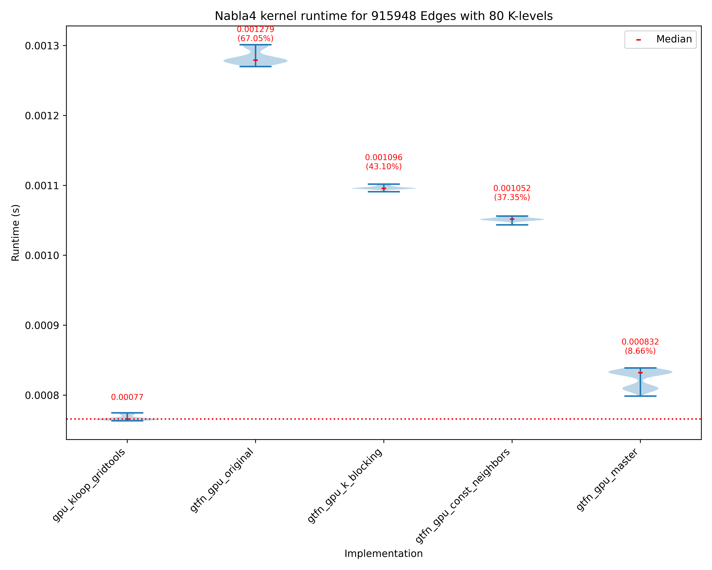

---

  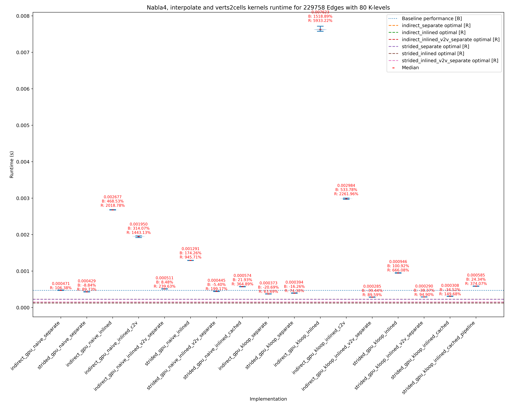

- `gpu_kloop` **~20-30%** faster
- `indirect` `nabla4_interpolate_inlined_v2v`/`strided` `nabla4_interpolate_inlined` & `indirect`/`strided` `verts2cells` separately fastest variation
- `strided` as fast or a bit faster than `inlined_v2v` (up to **8%**)
- Inlining the 3 kernels is not beneficial
  - `inlined_cached` version is fastest
  - Bottleneck is register pressure
- Still ~70-90% off the maximum theoretical optimal performance

---

## Next steps

- Compile time strides
  - `x_dim` is necessary to calculate the strides in `strided` version
    - Can be given in case of JIT compilation
- Use cache hints for loads and non temporal stores

---

## Next steps (probably not helpful but complex)

- Try `cached` approach for `indirect` implementation
  - Compute border coordinates for each Thread Block (should be the same as `strided` for our grid)
    - `per-vertex` ordering should be better due to smaller range of vertices/edges that need to be saved to shared memory
  - Load them to shared memory
- Try `TMA` implementation
  - Tried `cuda::pipeline` to use `LDGSTS`/`LDGSTS.BYPASS` instructions for loading the input fields of `nabla4` kernel combined with saving the `nabla4` output to memory
    - Didn't see an improvement
  - Try with `TMA` to see if it improves
  - More complex if possible due to memory alignment requirements
  - Probably doesn't help because of extra synchronization in the kernel

---

# Questions?

<!-- _paginate: skip  -->
<!-- _class: titlecover -->
<!-- _footer: "" -->

---

# Resources

- [GitHub Repository](https://github.com/GridTools/icon_structured_benchmark)

---

# Appendix

<!-- _paginate: skip  -->
<!-- _class: titlecover -->
<!-- _footer: "" -->

---

  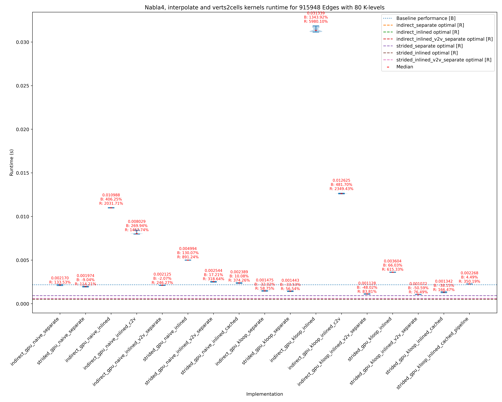

---

  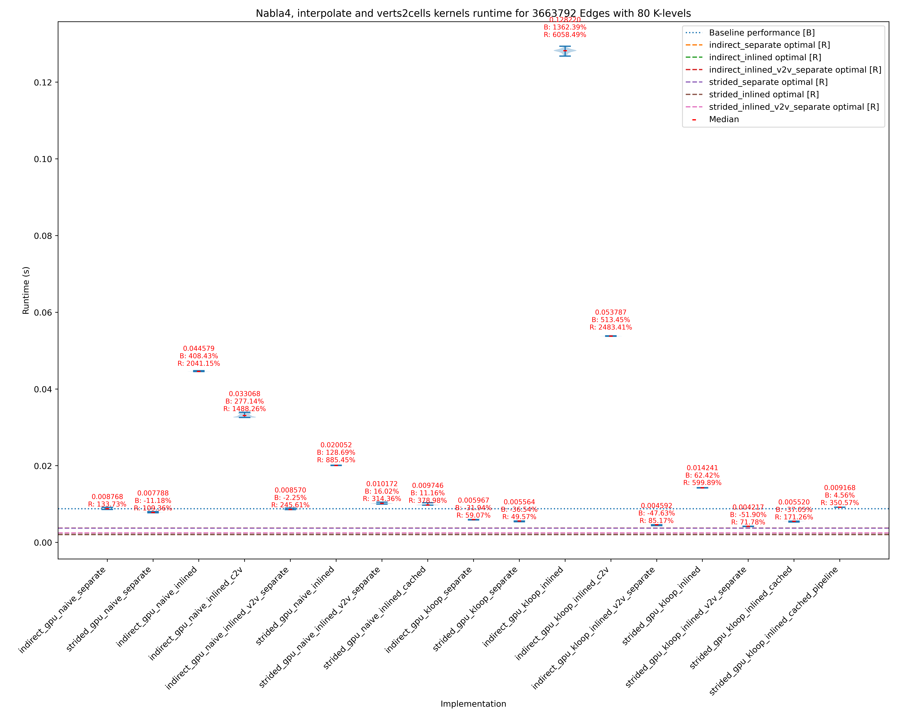

